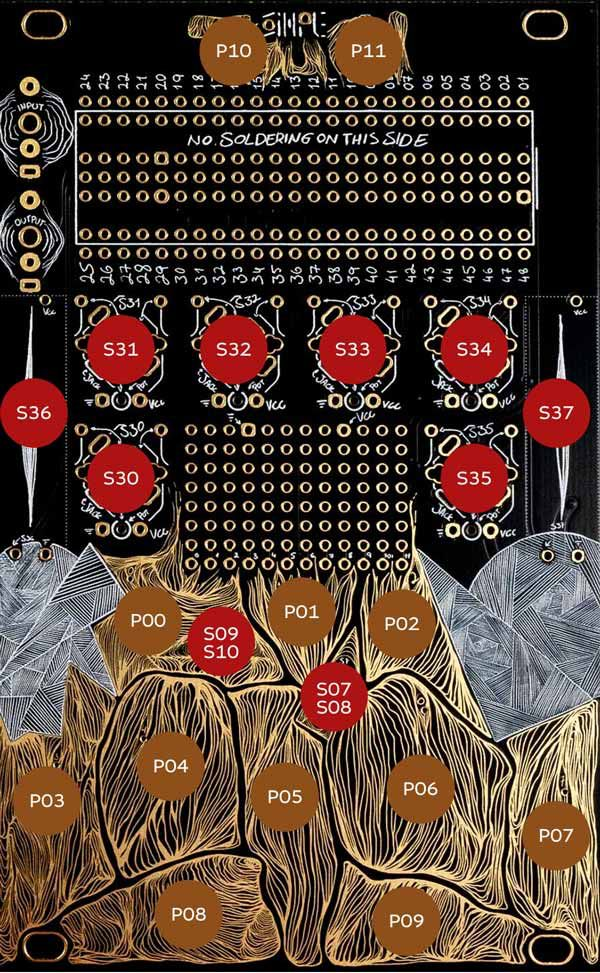

# THIS IS SIMPLE B

## QUICK INSTALL
Download the [Binary file](https://github.com/Synthux-Academy/TouchB/releases/latest/download/TouchB.bin) and flash using the [Daisy Seed web programmer](https://electro-smith.github.io/Programmer/)

## CONTROLS


**Switches**
- S07-S08 - fade in/regular/latch
- S09-S10 - reverse/random/formward

**Knobs**
- S30 - reverb amount
- S31 - LP/HP filter
- S31 + P10/P11 - input volume
- S32 - pitch +/- fifth, 1, 2 octaves
- S33 - start randomisation
- S34 - grains randomisation
- S35 - loop size
- S36 - loop start
- S37 - mix

**Pads**
- P03...P09 - loops
  
## PROJECT SETUP
```shell
$ git clone --recurse-submodules https://github.com/Synthux-Academy/TouchB.git
$ make libs
$ make
```

## UPLOAD
```shell
$ make program-dfu
```
